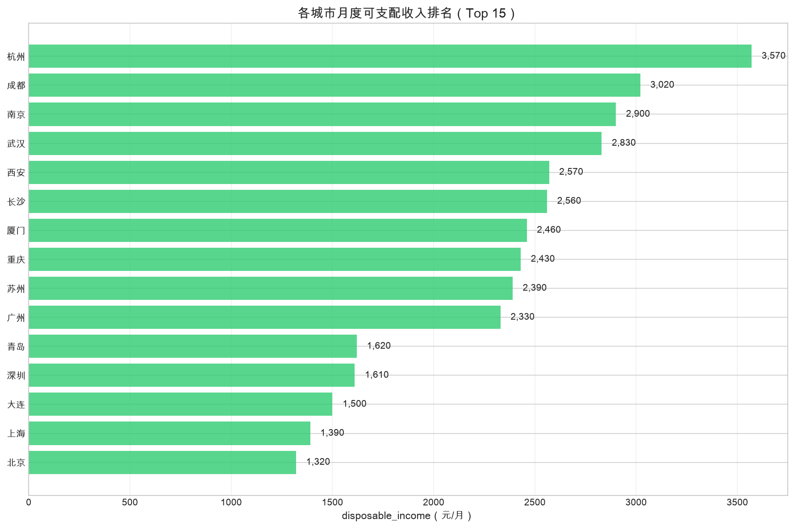
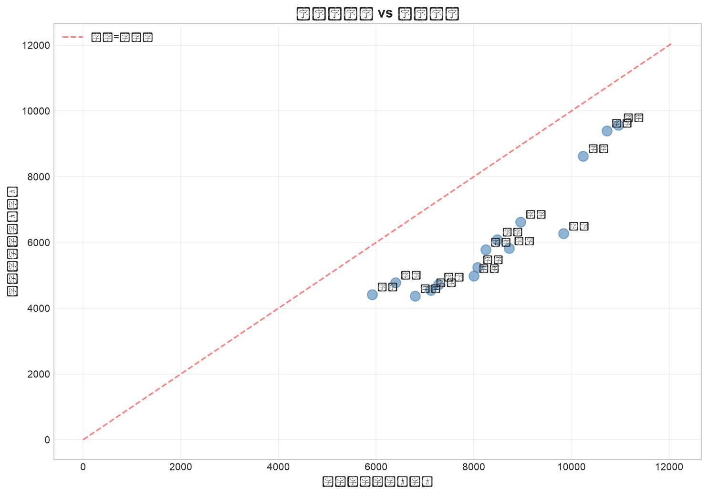
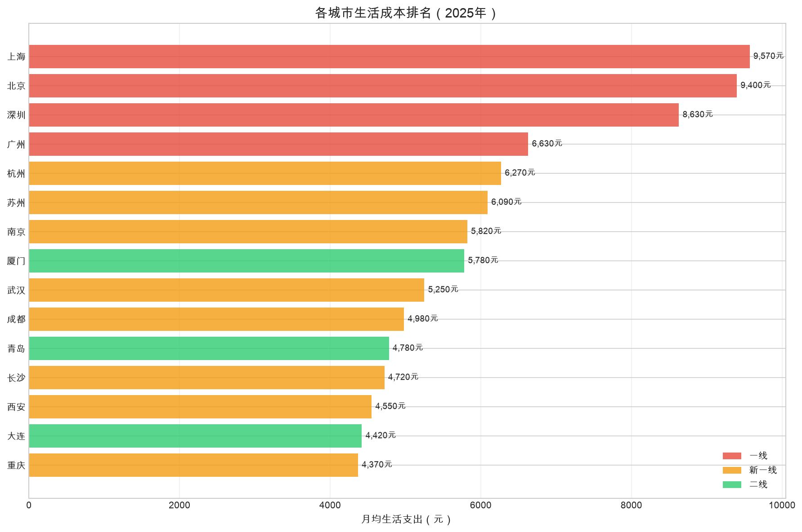
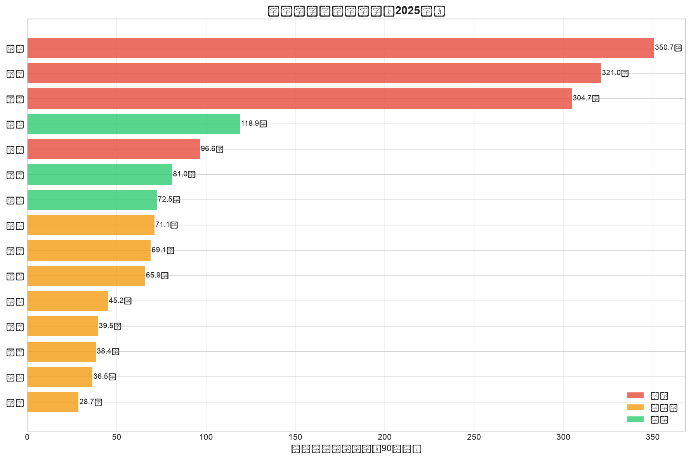
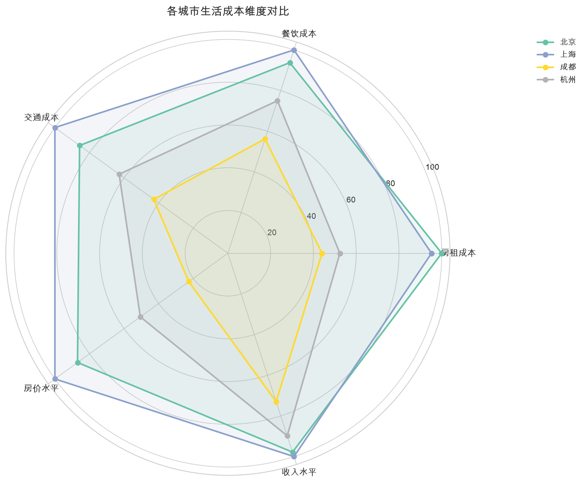
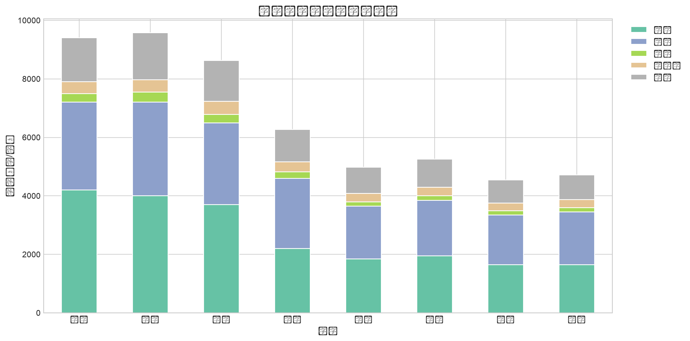

# 中国城市生活成本与性价比分析 | City Cost of Living Analysis

<div align="center">


[](https://github.com/harryhu321/city-cost-of-living-analysis/stargazers)
[](https://github.com/harryhu321/city-cost-of-living-analysis/network)

[](https://www.python.org/)
[](#-项目亮点--highlights)
[](https://city-cost-of-living-analysisbranchmain-gvvk65j2pshkbrekqykcg8.streamlit.app/)

### 税前月薪 1 万，在北京每月大约只剩 **1320 元**；在成都还能剩下 **3020 元**。

### If your gross monthly salary is RMB 10,000, you may keep only **RMB 1,320** in Beijing, but still save about **RMB 3,020** in Chengdu.

用 15 个中国城市的收入、租房、餐饮、交通和房价数据，回答一个所有打工人都关心的问题：**去哪座城市，最容易活得体面、存下钱、甚至买得起房？**

A data storytelling project comparing 15 Chinese cities across salary, living cost, savings potential, and housing pressure.

</div>

---

## ✨ 项目亮点 | Highlights

- 📌 **一句话看结论**：不是工资越高越容易攒钱，城市选择会直接改变你的剩余现金流。
- 📊 **6 张核心图表**：生活成本、支出结构、收入 vs 支出、可支配收入、买房压力、重点城市雷达图一站看全。
- 🧠 **适合真实决策**：适用于应届生选城市、职场人跳槽、内容创作者做选题、数据分析学习练手。
- 🏙️ **覆盖 15 个代表性城市**：一线 / 新一线 / 二线城市同维度对比，更容易发现“高薪陷阱”和“性价比洼地”。
- 🔍 **可复现分析流程**：提供 Notebook、批量生成脚本与图表输出，适合二次扩展和继续迭代。

## 🖼️ 图表预览 | Visual Preview

最值得先看的图放在前面：先看“赚多少、剩多少”，再看“花在哪、房压多大”。

### 1) 每月到底还能剩多少钱？ | Disposable Income Ranking

> 💡 **杭州以月存 3,570 元登顶，北京仅剩 1,320 元垫底——工资最高不等于存得最多。**



### 2) 高工资城市真的更划算吗？ | Salary vs Cost

> 💡 **杭州、成都、广州落在"高性价比区"——收入不低、支出可控；北京上海收入虽高但支出几乎吃光工资。**



### 3) 哪些城市生活成本最高？ | Cost Ranking

> 💡 **上海月均支出 9,570 元，是重庆（4,370 元）的 2.2 倍——同一个国家，生活成本差出一倍多。**



### 4) 买一套 90㎡ 房子，要攒多少年？ | Housing Affordability

> 💡 **长沙仅需 28.7 年全款买房，上海则需要 350+ 年——不吃不喝也买不起系列。**



### 5) 重点城市多维对比 | Radar Comparison

> 💡 **北京各维度"全面偏贵"，成都则在房租、餐饮、交通上全面低于一线——生活成本只有北京的 53%。**



### 6) 钱主要花在哪？ | Cost Breakdown

> 💡 **北京房租占税后收入的 39.2%，几乎吞掉四成工资；成都房租仅占 23.1%，负担直降一半。**



## 🧭 一眼选城

| 如果你最在意… | 推荐城市 | 原因 |
|:---:|:---:|:---|
| 💰 **存钱速度** | 杭州、成都 | 杭州月存 3,570 元全场第一；成都月存 3,020 元且生活舒适 |
| 🏠 **买房可行性** | 长沙、重庆 | 长沙 28.7 年、重庆 39.5 年即可全款买 90㎡，远低于一线 |
| 📈 **薪资天花板** | 上海、北京 | 税前月薪 13,000+ 元，适合攒经验后带走 |
| 🍜 **生活性价比** | 西安、重庆 | 月均支出不到 4,600 元，吃喝玩乐丰俭由人 |
| ⚖️ **收入支出平衡** | 杭州、广州 | 工资不低 + 支出可控，"体面地活着"不难 |

## 📌 核心发现 | Key Takeaways

- **北京** 税前月薪 13400 元，估算税后约 10720 元，月均支出约 9400 元，最后只剩 **1320 元**。
- **成都** 税前月薪 10000 元，估算税后约 8000 元，月均支出约 4980 元，还能剩下 **3020 元**，存款率约 **37.8%**。
- **杭州** 在样本中拥有最高月度可支配收入，约 **3570 元**，说明“高收入 + 相对可控支出”会显著提升体验。
- **长沙 / 重庆 / 西安** 在买房压力和生活成本上更友好，是“想稳稳过日子”的典型候选城市。
- **北上深** 仍然是薪资上限最高的地方，但高房租和高日常支出会快速吞噬现金流。

> 注：以上结论基于仓库当前内置的 2025 年样例数据，适合做城市横向比较与方法展示，不应替代个人真实决策。

## 📖 这个项目解决什么问题？ | Why This Project Matters

对于很多人来说，选城市并不是“喜欢哪里”这么简单，而是一个关于收入天花板、生活压力、存钱速度和未来定居成本的综合决策。这个项目把抽象的“城市性价比”拆成可量化的数据指标，尽量回答这些现实问题：**哪里更容易攒钱？哪里高薪但不一定高幸福感？哪里更适合作为长期落脚点？**

This repository turns a vague life decision into something measurable. Instead of only asking “Which city pays more?”, it also asks “How much can you actually keep every month?” and “How hard is it to buy a home there?”

## 🧮 数据说明与分析方法 | Data & Methodology

### 数据来源 | Data Sources

当前仓库使用的是可直接运行的样例数据，字段设计与真实采集流程参考以下公开来源：

- **生活成本**：Numbeo、公开消费价格信息
- **工资数据**：国家统计局、各城市统计公报 / 人社公开数据
- **房价与租金**：房价行情网站、房产平台公开数据
- **交通成本**：各地地铁 / 公交官网

详细说明可见：[`data/README.md`](data/README.md)

### 分析方法 | Methodology

项目核心逻辑非常直观：

1. 以税前月薪估算税后收入（当前样例按约 **80%** 估算）。
2. 汇总房租、餐饮、交通、水电网、其他支出，得到月均生活成本。
3. 用 `税后收入 - 月均支出` 计算可支配收入与存款率。
4. 用 90㎡ 住房总价 ÷ 年储蓄额，粗略估算买房压力。
5. 通过图表对比城市间的收入、支出、房价与综合性价比。

### 数据字段 | Main Metrics

| 指标 | 含义 |
| --- | --- |
| `avg_salary_before_tax` | 税前月薪 |
| `avg_salary_after_tax` | 估算税后月薪 |
| `monthly_expenses` | 房租 + 餐饮 + 交通 + 水电网 + 其他月支出 |
| `disposable_income` | 每月可支配收入 |
| `savings_rate` | 存款率 |
| `years_to_buy_house` | 全款购买 90㎡ 住房所需年数 |

## 🚀 如何运行 | How to Run

### 环境依赖 | Requirements

- Python **3.10+**
- 建议使用虚拟环境
- 依赖见 [`requirements.txt`](requirements.txt)

### 安装与运行 | Setup

```bash
git clone https://github.com/harryhu321/city-cost-of-living-analysis.git
cd city-cost-of-living-analysis
python3 -m venv .venv
source .venv/bin/activate
pip install -r requirements.txt
```

### 方式一：直接生成全部图表 | Option 1: Generate All Charts

```bash
python3 run_analysis.py
```

运行完成后，图表会输出到 `images/` 目录。

### 方式二：Streamlit 交互 Demo | Option 2: Interactive Demo

```bash
streamlit run app.py
```

打开浏览器访问 `http://localhost:8501`，输入你的税前月薪，对比不同城市的生活成本和存款潜力。

### 方式三：交互式查看 Notebook | Option 3: Explore in Jupyter Notebook

```bash
jupyter notebook notebooks/city_cost_analysis.ipynb
```

## 📂 项目结构 | Project Structure

```text
city-cost-of-living-analysis/
├── app.py                        # Streamlit 交互 Demo
├── notebooks/
│   └── city_cost_analysis.ipynb  # 交互式分析 Notebook
├── data/
│   └── README.md                 # 数据来源与字段说明
├── src/
│   └── utils.py                  # 计算与绘图工具函数
├── images/                       # 已生成图表（含封面图）
├── .github/ISSUE_TEMPLATE/       # Issue 模板
├── run_analysis.py               # 批量生成图表脚本
├── requirements.txt              # Python 依赖
└── README.md
```

## 🎯 适合谁看？ | Use Cases

- 正在纠结去哪座城市发展的应届生 / 求职者
- 想换城市、想知道“收入是否撑得起生活”的职场人
- 想做 **数据分析 / 数据可视化作品集** 的学习者
- 想写城市、房价、打工人生存话题的内容创作者

## 🤝 欢迎贡献 | Contributing

如果你觉得这个项目有意思，欢迎用任何一种方式参与：

- ⭐ **给仓库点个 Star** — 让更多人看到这个项目
- 🏙️ **[提交新城市请求](../../issues/new?template=city-request.md)** — 想看你的城市？告诉我们！
- 🔧 **[提交数据修正](../../issues/new?template=data-correction.md)** — 发现数据有误？帮我们改进
- 🍴 **Fork & PR** — 增加城市、优化图表、完善英文翻译
- 💬 **分享到社交媒体** — 让更多打工人看到"选城市"的数据视角

## 📝 免责声明 | Disclaimer

本项目主要用于数据分析展示、方法说明和城市横向对比。仓库中的数值为样例数据与公开信息整理后的估算，不构成投资、求职或迁居建议。不同城市中的行业、岗位、个人消费习惯和家庭背景差异，会显著影响真实结果。

---

<div align="center">

### ⭐ 如果这个项目帮你更快理解了“去哪座城市更值”，欢迎点个 Star 支持一下！

**用数据看城市，不靠滤镜做决定。**

</div>
